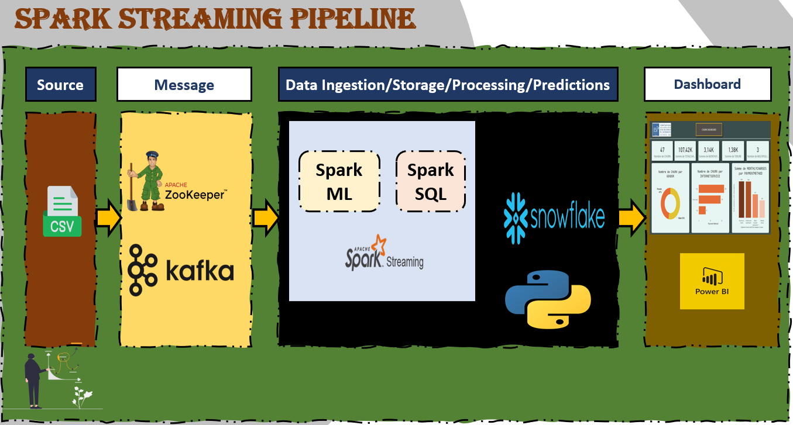

    
<h1 style='color:#4c4893' align='center'>
    Spark Structred Streaming.
</h1>


<div style="background-color:white; color:black; font-size:15px; font-family:Comic Sans MS; padding:10px; border: 5px solid black;font-weight:bold;border-radius: 20px;">
Nous avons developper un modèle de prédiction des churn de télécome en utilisant Pyspark le Notebook qui contient l'EDA et la construction de modèle (Random Forest) se situe dans le dossier <span style="color:orangered;">../SPARK_ML/ </span>
</div><br>

<div style="background-color:white; color:black; font-size:15px; font-family:Comic Sans MS; padding:10px; border: 5px solid black;font-weight:bold;border-radius: 20px;">
Dans ce répértoir on va charger et utiliser ce modèle développer qui se situe dans <span style="color:purple;">Model/random_forest_model</span> pour construire les prédictions sur l'ensemble de données <span style="color:purple;">churn_dataset.csv</span> 
</div><br>

<div style="background-color:white; color:black; font-size:15px; font-family:Comic Sans MS; padding:10px; border: 5px solid black;font-weight:bold;border-radius: 20px;">
Ce processus commencera par l'importation des données ligne par ligne avec Kafka vers spark Streaming ou les transformation seront executé et loader le modèle pour construire les prédictions et stocker le output sur Cassandra pour les visualiser ensuite en temp réel avec PowerBi .Tous cela est en temp réel .<br>
Le schema suivant montre ce processus:
</div><br>

<div style="text-align:center;height:70;">
    
</div><br>

<div style="background-color:white; color:black; font-size:15px; font-family:Comic Sans MS; padding:10px; border: 5px solid black;font-weight:bold;border-radius: 20px;">
Dans ce Répértoir vous allez trouver les éléments suivants:
<ul>
    <li><span style="color:purple">WA_Fn-UseC_-Telco-Customer-Churn.csv :</span><span style="color:olive">Fichier des données avec lesquels on va travailler</span></li>
    <li><span style="color:purple">Model :</span><span style="color:olive">Contient notre modèle Random Forest</span></li>
    <li><span style="color:purple">churn.py :</span><span style="color:olive">Contient le code qui sert à envoyer les données du fichier csv vers kafka</span></li>
    <li><span style="color:purple">Streaming.py :</span><span style="color:olive">Contient le code de connection de spark avec kafka ainsi que les transformations des données et la réalisation de prédiction en temps réel avec spark structured streaming et finalement l'importation des résultats à Snowflake </span></li>
    <li><span style="color:purple">ChurnDashboard.pbix :</span><span style="color:olive">Contient le Dashborad des visulisations avec les donnés reçu de Snowflake avec la fonctionnalité de DirectQuery de Power BI</span></li>
    <li><span style="color:purple">README.md :</span><span style="color:olive">Description des fichiers avec les commandes à exécuter</span></li>
</ul>
</div><br>

<div style="background-color:olive; color:white; font-size:15px; font-family:Comic Sans MS; padding:10px; border: 5px solid black;font-weight:bold;border-radius: 20px;">
la première chose à faire est de lancer zookepper</div><br>

```bash
bin/zookeeper-server-start.sh config/zookeeper.properties
```

<div style="background-color:olive; color:white; font-size:15px; font-family:Comic Sans MS; padding:10px; border: 5px solid black;font-weight:bold;border-radius: 20px;">
Ensuite on démarre le serveur de kafka </div><br>

```bash
bin/kafka-server-start.sh config/server.properties
```

<div style="background-color:olive; color:white; font-size:15px; font-family:Comic Sans MS; padding:10px; border: 5px solid black;font-weight:bold;border-radius: 20px;">
Ensuite on crée un topic pour notre projet qu'on va appeller churn</div><br>

```bash
bin/kafka-topics.sh --create --topic churn --bootstrap-server localhost:9092
```

<div style="background-color:olive; color:white; font-size:15px; font-family:Comic Sans MS; padding:10px; border: 5px solid black;font-weight:bold;border-radius: 20px;">
on peut s'assurer que le topic est crée en essayant la commande suivante</div><br>

```bash
bin/kafka-topics.sh --list --bootstrap-server localhost:9092
```

<div style="background-color:olive; color:white; font-size:15px; font-family:Comic Sans MS; padding:10px; border: 5px solid black;font-weight:bold;border-radius: 20px;">Ensuite on va changer de repertoire vers le dossier du projet, puis on va executer le fichier python qui sert à envoyer les données du fichier csv ligne par ligne au topic "churn" de kafka jouant ainsi le rôle d'un producer</div><br>

```bash
cd churn-project
python3 churn.py
```

<div style="background-color:olive; color:white; font-size:15px; font-family:Comic Sans MS; padding:10px; border: 5px solid black;font-weight:bold;border-radius: 20px;">Finalement on va exécuter notre application pyspark qui prend ces données là de kafka comme étant un consommateur, puis effectue les transformations necessaires et réaliser les prédictions en temps réel et finalement envoyer les résultats à snowflake</div><br>

```bash
spark-submit --packages org.apache.spark:spark-sql-kafka-0-10_2.12:3.5.0,net.snowflake:spark-snowflake_2.12:2.10.0-spark_3.2 Streaming.py
```

<div style="background-color:gray; color:white; font-size:15px; font-family:Comic Sans MS; padding:10px; border: 5px solid black;font-weight:bold;border-radius: 20px;text-align:center"> ✨ THE END ✨</div><br>